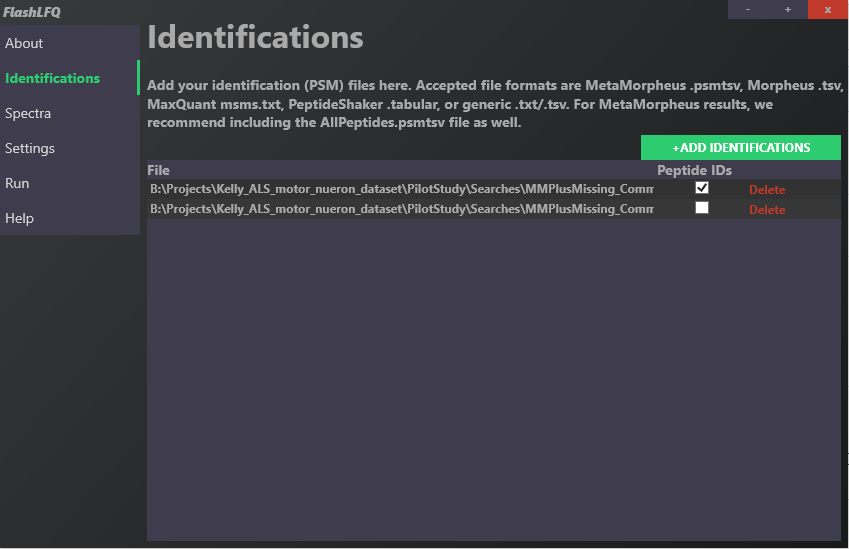
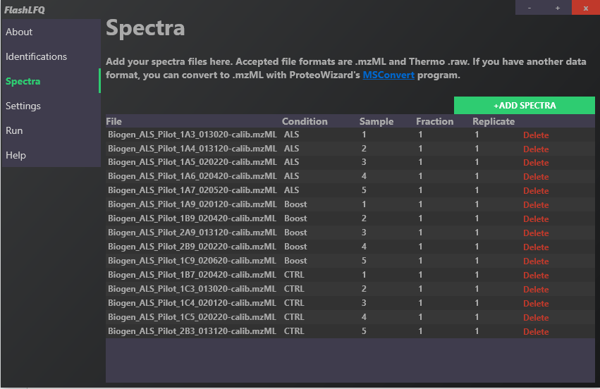
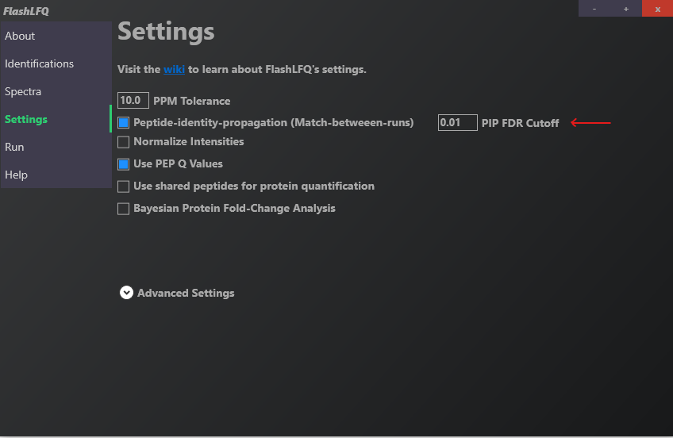
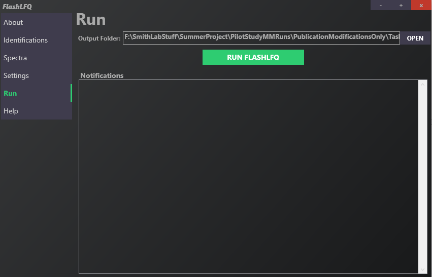

# Quantification with FlashLFQ + PIP-ECHO

## Installation
- Download [FlashLFQ](https://github.com/smith-chem-wisc/FlashLFQ)

## Running FlashLFQ
- Input: `AllPeptides.psmtsv`, `AllPSMs.psmtsv`, `.mzML` spectra files
- Output: `QuantifiedPeaks.tsv`, `QuantifiedPeptides.tsv`, `QuantifiedProteins.tsv`

## Walkthrough:
Identifications: Drag and drop  `AllPeptides_Renamed.psmtsv`, `AllPSMs_Renamed.psmtsv`

Spectra: Drag and drop `.mzML` spectra files from MetaMorpheus Calibration task
- Design an `ExperimentalDesign.tsv` file in the same folder as the `.mzML` files or manually edit `Condition`, `Sample`, `Fraction`, and `Replicate` within the GUI. After an initial FlashLFQ run, an Experimental Design file will be automatically created. 

Settings: Defaults and selection for `Peptide-identity-propagation (Match-between-runs)` at 0.01 PIP FDR Cutoff

Run: `RUN FLASHLFQ` change output folder if desired

> Reference: [*Improved detection of differentially abundant proteins through FDR-control of peptide-identity-propagation*](https://pubs.acs.org/doi/full/10.1021/acs.jproteome.5c00065)

Next up: [DEA with limpa](./limpa.md)