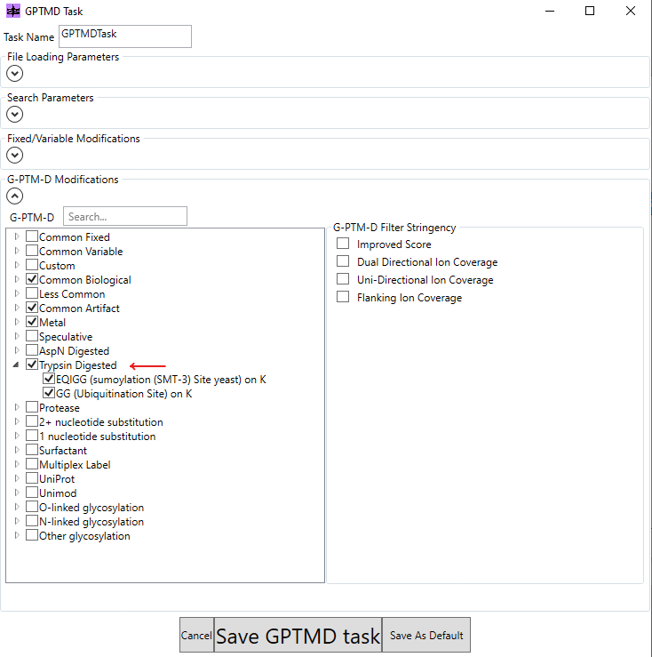

MetaMorpheus Setup

## Installation
- Download [MetaMorpheus](https://github.com/smith-chem-wisc/MetaMorpheus?tab=readme-ov-file)

## Running MetaMorpheus
- Input: `.raw` spectra files, `.fasta` protein database
- Output: `AllPeptides.psmtsv`, `AllProteinGroups.psmtsv`, `AllPSMs.psmtsv`

## Walkthrough:
Databases: Drag and drop `.fasta` database and `+ADD DEFAULT CONTAMINANTS`

Spectra: Drag and drop `.raw` spectra files

Tasks: 

- Task 1 `+ADD CALIBRATION` default
- Task 2 `+AVERAGE SPECTRA` default
- Task 3 `+ADD PTM DISCOVERY` with defaults and selection of Trypsin Digested modifications
    
- Task 4 `+ADD SEARCH` with no quantification (quantification performed separately in FlashLFQ)
    

Run: `RUN METAMORPHEUS` change output folder if desired

Next up: [Quant with FlashLFQ + PIP-ECHO](./flashlfq_pipecho.md)